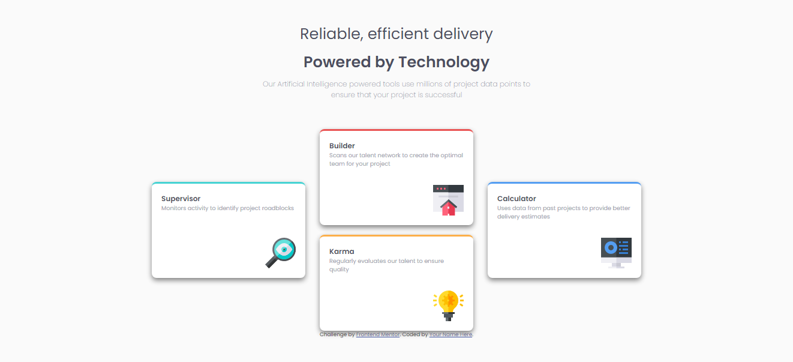

# Frontend Mentor - Four card feature section solution

This is a solution to the [Four card feature section challenge on Frontend Mentor](https://www.frontendmentor.io/challenges/four-card-feature-section-weK1eFYK). Frontend Mentor challenges help you improve your coding skills by building realistic projects. 

## Table of contents

- [Overview](#overview)
  - [The challenge](#the-challenge)
  - [Screenshot](#screenshot)
  - [Links](#links)
- [My process](#my-process)
  - [Built with](#built-with)
  - [What I learned](#what-i-learned)
- [Author](#author)

## Overview

Have replicated the frontend mentor design with Four card feature layout.

### The challenge

Users should be able to:

- View the optimal layout for the site depending on their device's screen size.

### Screenshot

### Links

- Solution URL: [Add solution URL here](https://your-solution-url.com)
- Live Site URL: [Add live site URL here](https://your-live-site-url.com)

## My process

### Built with

- Semantic HTML5 markup
- Flexbox
- Media Queries to support responsiveness.

### What I learned

    - Got better understanding with usage of media queries and css Flexbox.

### Continued development

    - Got better at using width and measurement units to support responsiveness, but still think I need more practise at using measurements like rem, vh, etc., to support better responsiveness.

## Author

- Frontend Mentor - [@kiran1095](https://www.frontendmentor.io/profile/kiran1095)
